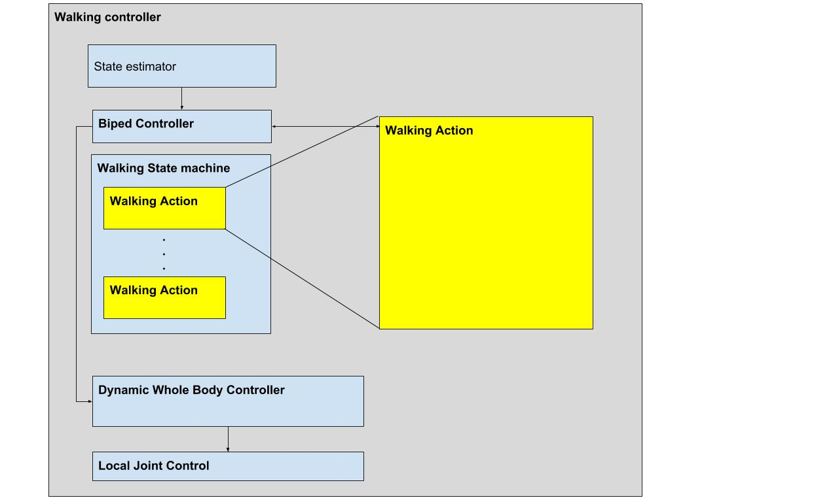

# TALOS PAL Locomotion
This package contains the default stack, and the main parameters involved in the DCM controller. 

## The DCM controller
The DCM controller implemented in this package is the evolution and unification of previous developed components at PAL. The computation flow is as follows:



1. The robot updates the state of its actuators and floating base state using the state estimator.
1. The internal state machine computes operational state desired quantities, such as COM acceleration, torso orientation, foot Cartesian references, etc...
1. The operation targets are fed to the inverse dynamics wbc controller.
1. The desired torques are commanded to the local joint controller.

### Starting the controller

To start DCM controller in simulation (Gazebo or PAL physics simulator without actuator dynamics):
```
$ roslaunch talos_pal_locomotion talos_dcm_walking_controller.launch
```

To start the DCM controller in PAL physics simulator with actuator dynamics:

```
$ roslaunch talos_pal_locomotion robot_dcm_walking_controller.launch simulation:=true
```

To start the DCM controller on the real robot, launch:

```
$ roslaunch talos_pal_locomotion robot_dcm_walking_controller.launch
```

If the user wants to maintain the upper body in position then:

```
$ roslaunch talos_pal_locomotion robot_dcm_walking_controller.launch robot:=full_v2_fixed_upper_body
```

**Once the controller is stopped it sends zero torque to all controlled joints.**

## Safety
There are safety layers that are launched along with this DCM controller that help the controller to shutdown, in case the dynamics of the robot becomes unstable. The available safety levels are 

1. The **DCM Monitor**: this continuously checks if the COM is within the support polygon or not. If the COM diverges outside the support polygon, then it shuts the controller down. This is disabled when the robot is on dynamic walk (i.e non quasi-static walking).
2. The **Foot Contact Monitor**: this continuously checks that at least a certain amount of weight is read by both FT's i.e., if the respective aspect of weight distribution between the Single Support (SS) and Double Support (DS) is maintained properly. If these deviates, then the biped controller is shut down.
3. The **Local Joint Control Safety**: this is a safety layer that is implemented at the local joint control level. This checks if the joint is reaching an unsafe position, velocity, effort, collision impulse, etc. If so, then the controller is shut down.

### Disabling Safety
**It is highly discouraged to disable any safety layer when performing experiments in the robot. You may proceed at your own risk, but PAL Robotics is not liable for any damage done to the robot when any safety layer is disabled.**

The DCM Monitor and the Foot Contact Monitor can be disabled by a parameter defined in the [biped_parameters.yaml](./config/biped_parameters.yaml) file.

To disable the safety at the local joint control level, it can be done in 2 ways:

1. On the one hand, one can set the `enable_safety` status to `false` for each joint in the [actuator_safety_specific_params.yaml](https://gitlab/robots/talos_robot/-/blob/erbium-devel/talos_controller_configuration/config/local_joint_control/actuator_parameters/actuator_safety_specific_params.yaml) file of the package `talos_controller_configuration`.

1. On the other hand, one can choose the joints whose safety needs to be disabled by a roslaunch argument when launching the DCM controller. For instance, to disable the safety for the joints `leg_left_6_joint` and `leg_right_6_joint`, one should do

```
$ roslaunch talos_pal_locomotion robot_dcm_walking_controller.launch disable_safety_for_joints:=leg_left_6_joint,leg_right_6_joint
```

## Parameters
This package contains all the parameters used in the DCM controller and in the state estimator.

### WBC Parameters
The DCM controller uses PAL Robotics's Whole Body Control (WBC) framework as a base. See [pal_wbc_utils](https://github.com/pal-robotics/pal_wbc_utils) for further information.

When the controller is started, a set of dynamic tasks are loaded in the stack (the default stack is defined [here](./src/walking_wbc_base.cpp). These tasks include:
- Control of the Base in Cartesian space
- Control of the Center of Mass (CoM)
- Control of both feet in Cartesian space
- Control of the angular momentum
...

There are also some constraints that are enforced via the controller, that include:
- Torque limits constraint
- Inverse dynamic constraint
- Friction cone constraints

The solver outputs the optimal torque that minimizes the objective function and satisfies all the constraints, according to the weight of each of tasks.

All these tasks are defined by a set of parameters that can be modified at [wbc_common_parameters.yaml](./config/wbc_common_parameters.yaml). **Increasing or decreasing the gains may be dangerous**, as these affect the performance of the DCM controller. PAL Robotics recommends to test any change in the gains in simulation before setting them in the real robot. Any change in the gains is recommended to be done by and slightly keep increasing / decreasing up to the desired values and tracking the behaviour along the way.

### Biped Parameters
The DCM controller has an internal state machine with a set of actions that outputs the desired references of the WBC.

The defined actions are:
- Balancing in DS
- Support on a single leg
- Quasi-static walk
- Dynamic walking
- Squatting
- Manipulation

These tasks are defined in the [pal_locomotion_tutorials](https://gitlab/control/pal_locomotion_tutorials), [pal_locomotion_actions](https://gitlab/control/pal_locomotion_actions), [pal_locomotion_dcm_planner](https://gitlab/control/pal_locomotion_dcm_planner) packages, and are loaded dynamically as a plugin in the DCM controller.

The parameters of these tasks, as well as other generic parameters of the DCM controller, are defined in the [biped_parameters.yaml](./config/biped_parameters.yaml).

The most relevant ones are:
- **icp_gain**: Proportional gain added as a regularization term to the desired reference of the ICP.
- **swing_leg_height**: Default height of the COM
- **default_ds_time**: DS time for the quasi-static walk action.
- **default_ss_time**: SS time for the quasi-static walk action.
- **swing_leg_height**: Height of the swing leg trajectory when walking.
- **acceptable_com_ds_reference_error**: Tolerance in the COM when DS to go to next state. It's from the quasi-static walk action.
- **acceptable_com_ss_reference_error**: Tolerance in the COM when SS to go to next state. It's from the quasi-static walk action.
- **default_foot_separation**: Default foot separation in the quasi-static walk action.
- **minimum_contact_force**: Threshold in the F/T z force to detect it as a contact.
- **step_saggital_bounds**: Max allowed distance in the x-axis when quasi-static walking.
- **step_coronal_bounds**: Max allowed distance in the y-axis when quasi-static walking.
- **step_rotational_bounds**: Max rotational angle when quasi-static walking.
- **step_axial_bounds**: Max allowed distance in the z-axis when quasi-static walking.
- **static_walk_offset**: Offset added to the COM when SS in the quasi-static walking action.

In case that a specific experiment needs to overwrite some parameters, it could be done using the arg `biped_parameters` in the launch file. Then it searches for the specific file at `config/extras`. Example:
```
$ roslaunch talos_pal_locomotion robot_dcm_walking_controller.launch biped_parameters:=balancing
```

### Estimator parameters
The estimator estimates the position, orientation, linear velocity and angular velocity of the floating base and inputs it in the system.

There are two different estimators implemented:
- kinematic_state_estimator
- legged_state_estimator

The kinematic_state_estimator is the one used by default. The parameters of the estimator could be modified at [biped_parameters.yaml](./config/estimator/kinematic_estimator_params.yaml).
